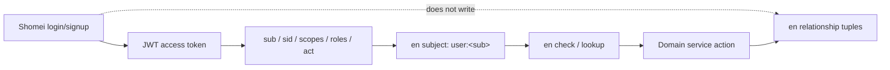
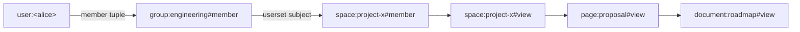
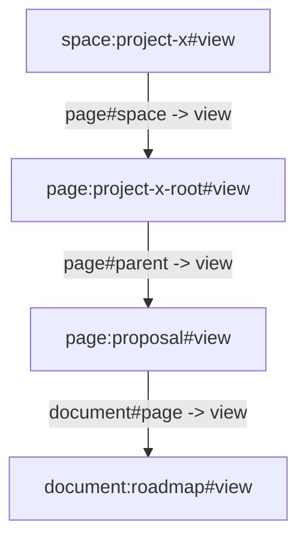
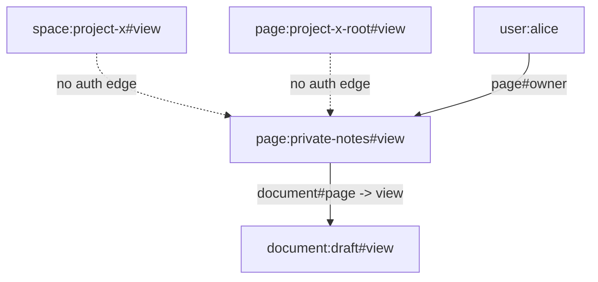
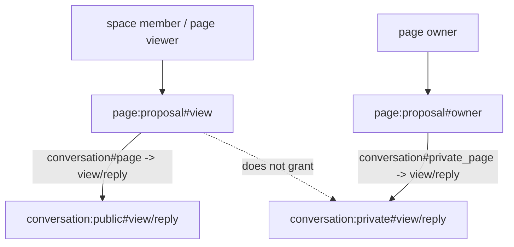
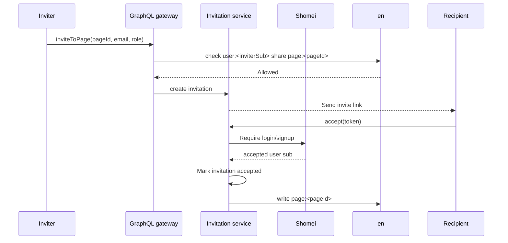
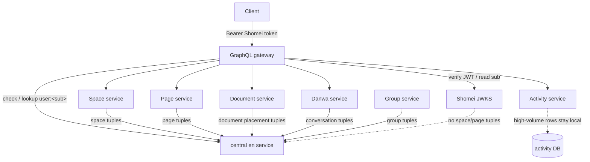

# Space, Page, and Invitation Modeling

This guide models a common collaboration product:

- Users can create spaces.
- A user or group can receive access to a space.
- Space access grants access to pages, documents, and activity in that space.
- Pages form a hierarchy.
- An invited user can receive access to only one page subtree inside a space.
- Pages can have Danwa conversations. Public conversations inherit page access;
  private conversations are visible only to the page owner.

The important modeling choice is to store slow-changing relationship facts in
`en` and keep high-volume domain rows in the owning services. Space membership,
group membership, page parent links, and sharing grants are `en` tuples.
Document contents, activity rows, comments, and search indexes stay in their
own service databases.

## Schema

Use the schema builder DSL to define principals, containers, and protected
resources:

```haskell
{-# LANGUAGE OverloadedStrings #-}

import En.Schema (Schema)
import En.Schema.Builder qualified as Schema

collaborationSchema :: Schema
collaborationSchema =
    Schema.build
        [ Schema.object "user" []
        , Schema.object
            "group"
            [ Schema.relation "owner" [Schema.subject "user"] Schema.this
            , Schema.relation "member" [Schema.subject "user"] Schema.this
            , Schema.permission "manage" (Schema.computed "owner")
            ]
        , Schema.object
            "space"
            [ Schema.relation "owner" [Schema.subject "user"] Schema.this
            , Schema.relation
                "member"
                [ Schema.subject "user"
                , Schema.userset "group" "member"
                ]
                Schema.this
            , Schema.permission
                "view"
                ( Schema.anyOf
                    (Schema.computed "owner")
                    [Schema.computed "member"]
                )
            , Schema.permission
                "edit"
                ( Schema.anyOf
                    (Schema.computed "owner")
                    [Schema.computed "member"]
                )
            , Schema.permission "admin" (Schema.computed "owner")
            ]
        , Schema.object
            "page"
            [ Schema.relation "owner" [Schema.subject "user"] Schema.this
            , Schema.relation "space" [Schema.subject "space"] Schema.this
            , Schema.relation "parent" [Schema.subject "page"] Schema.this
            , Schema.relation "viewer" [Schema.subject "user"] Schema.this
            , Schema.relation "editor" [Schema.subject "user"] Schema.this
            , Schema.permission
                "view"
                ( Schema.anyOf
                    (Schema.computed "owner")
                    [ Schema.computed "viewer"
                    , Schema.computed "editor"
                    , Schema.arrow "space" "view"
                    , Schema.arrow "parent" "view"
                    ]
                )
            , Schema.permission
                "edit"
                ( Schema.anyOf
                    (Schema.computed "owner")
                    [ Schema.computed "editor"
                    , Schema.arrow "space" "edit"
                    , Schema.arrow "parent" "edit"
                    ]
                )
            , Schema.permission
                "share"
                ( Schema.anyOf
                    (Schema.computed "owner")
                    [ Schema.arrow "space" "admin"
                    , Schema.arrow "parent" "share"
                    ]
                )
            ]
        , Schema.object
            "document"
            [ Schema.relation "page" [Schema.subject "page"] Schema.this
            , Schema.permission "view" (Schema.arrow "page" "view")
            , Schema.permission "edit" (Schema.arrow "page" "edit")
            ]
        , Schema.object
            "conversation"
            [ Schema.relation "page" [Schema.subject "page"] Schema.this
            , Schema.relation "private_page" [Schema.subject "page"] Schema.this
            , Schema.permission
                "view"
                ( Schema.anyOf
                    (Schema.arrow "page" "view")
                    [Schema.arrow "private_page" "owner"]
                )
            , Schema.permission
                "reply"
                ( Schema.anyOf
                    (Schema.arrow "page" "view")
                    [Schema.arrow "private_page" "owner"]
                )
            ]
        , Schema.object
            "activity"
            [ Schema.relation "space" [Schema.subject "space"] Schema.this
            , Schema.relation "page" [Schema.subject "page"] Schema.this
            , Schema.permission
                "view"
                ( Schema.anyOf
                    (Schema.arrow "space" "view")
                    [Schema.arrow "page" "view"]
                )
            ]
        ]
```

This schema has these access paths:

- `group#owner` grants `group#manage`.
- `group#member` stores users who belong to a group.
- `space#owner` grants `space#view`, `space#edit`, and `space#admin`.
- `space#member` grants `space#view` and `space#edit`.
- `space#member` accepts either a concrete `user` or the userset
  `group#member`.
- `page#owner` grants `page#view`, `page#edit`, and `page#share`.
- `page#view` is granted by page owner, direct page viewers, direct page
  editors, the containing space, or a parent page.
- `document#view` and `document#edit` come from the document's page.
- Public `conversation#view` and `conversation#reply` come from the attached
  page's `view` permission.
- Private `conversation#view` and `conversation#reply` come only from the
  attached page's `owner` relation.
- `activity#view` comes from either its space or its page.

Use separate permissions when product behavior differs. For example, if space
members should view but not edit every page, remove `Schema.arrow "space" "edit"`
from `page#edit` and grant page editors explicitly.

## Object ids

`en` treats object ids as opaque text. Use stable ids from the owning services:

```text
user:alice
group:engineering
space:project-x
page:project-x-root
page:proposal
document:roadmap
conversation:conversation_01HX...
activity:act-01HX...
```

For `user`, use the stable Shomei user id from the verified access token's
`sub` claim. Do not use the user's email address, login id, display name, or
session id as the `en` object id.

The examples below use readable ids such as `user:alice`, but a production
tuple should look more like:

```text
user:user_01HX...
```

where `user_01HX...` is the Shomei `UserId` rendered as text.

The object type names in `en` do not need to match GraphQL type names exactly,
but keeping them close reduces translation mistakes.

## Authenticated users from Shomei

Shomei authenticates the caller. `en` authorizes what the authenticated caller
may do to one object.

The normal request flow is:

```text
client
  -> Authorization: Bearer <Shomei access token>
  -> gateway or service verifies token with Shomei/JWKS
  -> read sub, sid, scopes, roles, and optional act
  -> construct en subject from sub
  -> call en.check or en.lookup
```

```mermaid
sequenceDiagram
    participant Client
    participant Gateway as GraphQL gateway / API
    participant Shomei as Shomei JWKS / token verifier
    participant En as en
    participant Service as Resource service

    Client->>Gateway: Authorization: Bearer access token
    Gateway->>Shomei: Verify JWT locally with cached JWKS
    Shomei-->>Gateway: sub, sid, scopes, roles, optional act
    Gateway->>En: check or lookup as user:&lt;sub&gt;
    En-->>Gateway: Allowed / Denied / Conditional
    Gateway->>Service: Authorized narrowed request
    Service-->>Gateway: Domain data
    Gateway-->>Client: Response
```

The mapping is intentionally simple:

```haskell
shomeiSubjectToEnSubject :: ShomeiUserId -> Subject
shomeiSubjectToEnSubject userId =
    SubjectId
        ( ObjectRef
            (ObjectType "user")
            (renderShomeiUserId userId)
        )
```

Use the `sub` identity as the authorization subject:

- Normal login token: `sub` is the user, so check `user:<sub>`.
- Delegated or impersonation token: `sub` is the customer being acted upon and
  `act` is the real operator. Check `en` as `user:<sub>` and record/audit
  `act` separately.
- Service token: `sub` is the configured service-account user id. Use
  `RequireScope` or equivalent service-scope checks for machine permissions.
  Only map the service token to a human `en` subject when the service is
  explicitly acting on behalf of a user and that user id is present in a
  trusted claim or request context.

Shomei roles and scopes are coarse gates. `en` permissions are object gates.
Use both:

```text
RequireScope "spaces:write"
  -> check user:<token.sub> admin space:project-x
  -> perform the mutation
```

Shomei does not need to know about spaces, pages, documents, or groups. `en`
does not need to verify passwords, sessions, MFA, JWT signatures, or token
freshness.

No `en` tuple is required just because a user signs up or logs in. The `user`
object type is a principal namespace. Tuples are written when the product grants
relationships such as group membership, space ownership, or page sharing.

The boundary is:



## Creating a space

When a user creates a space, the space service writes the domain row and the
owner tuple.

```haskell
Tuple
    { object = ObjectRef (ObjectType "space") "project-x"
    , relation = RelationName "owner"
    , subject = SubjectId (ObjectRef (ObjectType "user") "alice")
    , caveat = Nothing
    }
```

After this tuple, `user:alice` can:

- View the space through `space#view = owner + member`.
- Edit the space through `space#edit = owner + member`.
- Admin the space through `space#admin = owner`.
- View and edit pages that point at the space.
- View documents and activity attached to those pages.

The space service should write this tuple transactionally with the space create
when possible. If tuple writing is asynchronous, make it idempotent and run a
reconciliation job from the space table.

The full service flow is:

```text
POST /graphql Mutation.createSpace
  -> GraphQL gateway verifies Shomei token
  -> GraphQL gateway calls space service with caller sub
  -> space service enforces coarse Shomei scope, if required
  -> space service creates space row
  -> space service writes space:project-x#owner@user:<sub> to en
  -> space service returns the en consistency token with the domain result
```

If the GraphQL response immediately reads the new space, use
`AtLeastAsFresh token` with the token returned by the tuple write so the user
can observe their own grant.

```mermaid
sequenceDiagram
    participant Client
    participant Gateway as GraphQL gateway
    participant Space as Space service
    participant En as en

    Client->>Gateway: createSpace
    Gateway->>Gateway: Verify Shomei token, subject=user:&lt;sub&gt;
    Gateway->>Space: createSpace(caller=sub)
    Space->>Space: Insert space row
    Space->>En: write space:&lt;id&gt;#owner@user:&lt;sub&gt;
    En-->>Space: ConsistencyToken
    Space-->>Gateway: Space + token
    Gateway-->>Client: Space
```

## Creating a group

The group service owns groups. If users can create groups themselves, group
creation should write an owner tuple:

```haskell
Tuple
    { object = ObjectRef (ObjectType "group") "engineering"
    , relation = RelationName "owner"
    , subject = SubjectId (ObjectRef (ObjectType "user") "alice")
    , caveat = Nothing
    }
```

That tuple grants `user:alice` `group:engineering#manage` in the example
schema. The group service can use `check user manage group:engineering` before
allowing group membership changes initiated by users.

If groups are administered only by an internal directory service, the group
service can instead gate writes with Shomei service scopes and skip user-driven
`group#manage` checks. The `group#owner` relation is useful only if group
management itself is a user-facing product feature.

## Adding users to a group

The group service owns group membership. Adding Alice to Engineering writes:

```haskell
Tuple
    { object = ObjectRef (ObjectType "group") "engineering"
    , relation = RelationName "member"
    , subject = SubjectId (ObjectRef (ObjectType "user") "alice")
    , caveat = Nothing
    }
```

This tuple does not grant access to any space by itself. It only says Alice is
in the group. Access is granted when another tuple uses the group userset as a
subject.

To remove Alice from Engineering, delete the same tuple. After the deletion,
future checks that depend only on `group:engineering#member` no longer allow
Alice.

For a user-facing "add member" mutation, the service flow is:

```text
Mutation.addGroupMember(groupId, userId)
  -> verify Shomei token
  -> subject = user:<token.sub>
  -> check subject manage group:<groupId>
  -> if Allowed, group service inserts membership row
  -> group service writes group:<groupId>#member@user:<userId> to en
  -> return consistency token
```

For an internal identity-sync job, the flow is different:

```text
directory-sync service
  -> obtains Shomei service token with scope groups:sync
  -> group service verifies token and RequireScope "groups:sync"
  -> group service upserts membership rows
  -> group service writes/deletes matching en group#member tuples
```

In both flows, Shomei authenticates the caller and carries coarse scopes. `en`
answers whether the acting user can manage that particular group, and stores
the membership tuple that other permissions depend on.

```mermaid
sequenceDiagram
    participant Gateway as GraphQL gateway
    participant Group as Group service
    participant En as en

    Gateway->>Group: addGroupMember(groupId, targetUserId, caller=sub)
    Group->>En: check user:&lt;sub&gt; manage group:&lt;groupId&gt;
    En-->>Group: Allowed
    Group->>Group: Insert membership row
    Group->>En: write group:&lt;groupId&gt;#member@user:&lt;targetUserId&gt;
    En-->>Group: ConsistencyToken
```

## Granting a group access to a space

The space service or sharing workflow can grant Engineering access to a space:

```haskell
Tuple
    { object = ObjectRef (ObjectType "space") "project-x"
    , relation = RelationName "member"
    , subject =
        SubjectSet
            (ObjectRef (ObjectType "group") "engineering")
            (RelationName "member")
    , caveat = Nothing
    }
```

That tuple means:

```text
space:project-x#member includes group:engineering#member
```

Every current and future member of `group:engineering#member` can view and edit
`space:project-x` according to the `space` permissions. The space tuple does not
need to be rewritten when group members change. Group membership changes are
resolved at check time through the userset.

This is the key distinction:

- `group:engineering#member@user:alice` stores group membership.
- `space:project-x#member@group:engineering#member` grants the group access.

Both must be present for Alice to receive access through the group.

The service flow for granting a group to a space is:

```text
Mutation.grantGroupToSpace(spaceId, groupId)
  -> verify Shomei token
  -> subject = user:<token.sub>
  -> check subject admin space:<spaceId>
  -> optionally check subject manage group:<groupId>
  -> space service records the share in its domain table
  -> space service writes space:<spaceId>#member@group:<groupId>#member to en
```

Whether to require both `space#admin` and `group#manage` is a product rule. If
space admins may invite any group by id, only check `space#admin`. If group
owners must consent before their group is attached to a space, require both.



## Adding users directly to a space

If Bob should have direct space access without a group:

```haskell
Tuple
    { object = ObjectRef (ObjectType "space") "project-x"
    , relation = RelationName "member"
    , subject = SubjectId (ObjectRef (ObjectType "user") "bob")
    , caveat = Nothing
    }
```

This grants Bob the same `space#view` and `space#edit` permissions as a member
coming from a group userset. Use separate relations such as `viewer`, `editor`,
and `admin` if the product needs more granular space roles.

The direct-space flow is:

```text
Mutation.addSpaceMember(spaceId, userId)
  -> verify Shomei token
  -> subject = user:<token.sub>
  -> check subject admin space:<spaceId>
  -> space service writes space:<spaceId>#member@user:<userId> to en
```

The `userId` being added must be a Shomei user id. If the UI starts from an
email address or login id, resolve it through the identity/user service before
writing the `en` tuple.

## Creating pages

The page service owns page containment. A root page can point directly at the
space:

```haskell
Tuple
    { object = ObjectRef (ObjectType "page") "project-x-root"
    , relation = RelationName "space"
    , subject = SubjectId (ObjectRef (ObjectType "space") "project-x")
    , caveat = Nothing
    }
```

A child page points at its parent:

```haskell
Tuple
    { object = ObjectRef (ObjectType "page") "proposal"
    , relation = RelationName "parent"
    , subject = SubjectId (ObjectRef (ObjectType "page") "project-x-root")
    , caveat = Nothing
    }
```

With these tuples, a user who can view `space:project-x` can view
`page:project-x-root`, and then can view `page:proposal` through
`page#parent -> page#view`.

You may also write `page:proposal#space@space:project-x` as a denormalized
containment tuple if the page service needs direct space filters. If you do,
keep it consistent with the parent tree through the page service or a
reconciliation job.

Creating a root page:

```text
Mutation.createPage(spaceId, parentPageId = null)
  -> verify Shomei token
  -> subject = user:<token.sub>
  -> check subject edit space:<spaceId>
  -> page service creates page row
  -> page service writes page:<pageId>#space@space:<spaceId> to en
```

Creating a child page:

```text
Mutation.createPage(spaceId, parentPageId)
  -> verify Shomei token
  -> subject = user:<token.sub>
  -> check subject edit page:<parentPageId>
  -> page service creates page row
  -> page service writes page:<pageId>#parent@page:<parentPageId> to en
  -> optionally writes page:<pageId>#space@space:<spaceId> for indexing
```

The page service should validate that the parent belongs to the requested
space. That is domain integrity, not an `en` authorization question.



## Private owner-only pages

A page can belong to a space in the product database without inheriting space
access in `en`. This is the simplest way to model an owner-only private page.

Use two separate ideas:

- Domain containment: the page service stores `space_id` and maybe `parent_id`
  so the page appears in the product's tree.
- Authorization inheritance: `en` stores `page#space` and `page#parent` only
  when access should inherit from the space or parent page.

For a normal inherited page, write one of these tuples:

```text
page:proposal#space@space:project-x
page:proposal#parent@page:project-x-root
```

For a private owner-only page, write only an owner tuple:

```haskell
Tuple
    { object = ObjectRef (ObjectType "page") "private-notes"
    , relation = RelationName "owner"
    , subject = SubjectId (ObjectRef (ObjectType "user") "alice")
    , caveat = Nothing
    }
```

Do not write:

```text
page:private-notes#space@space:project-x
page:private-notes#parent@page:project-x-root
```

The page may still have `space_id = project-x` and `parent_id =
project-x-root` in the page service database. It just does not have
authorization inheritance edges in `en`.

The create flow is:

```text
Mutation.createPage(spaceId, parentPageId, visibility = private)
  -> verify Shomei token
  -> subject = user:<token.sub>
  -> check subject edit space:<spaceId> or edit page:<parentPageId>
  -> page service creates page row with visibility = private
  -> page service writes page:<pageId>#owner@user:<token.sub>
  -> page service does not write page#space or page#parent auth tuples
```

The initial `check edit space` or `check edit parent` is a creation gate: it
answers whether the user may create a private page at that location. It does
not become an inherited runtime permission.

After creation:

```text
check user:alice view page:private-notes  => Allowed
check user:bob view page:private-notes    => Denied
```

Even if Bob can view `space:project-x`, Bob cannot view `page:private-notes`
because there is no `page#space` or `page#parent` tuple for the checker to
follow.

Documents under the private page inherit from the private page:

```text
document:draft#page@page:private-notes
document:draft#view = page:private-notes#view
```

So only the page owner can view the document unless another explicit page grant
is added.



To share a private page with one other user, add an explicit `viewer` or
`editor` tuple:

```haskell
Tuple
    { object = ObjectRef (ObjectType "page") "private-notes"
    , relation = RelationName "viewer"
    , subject = SubjectId (ObjectRef (ObjectType "user") "bob")
    , caveat = Nothing
    }
```

That grants Bob access to the private page and descendants that inherit from
it, but still does not grant access to sibling pages or the containing space.

To make a private page public to the space later, the page service writes the
missing inheritance edge:

```text
page:private-notes#space@space:project-x
```

To make an inherited page private later, the page service deletes its
authorization inheritance edges and writes an owner tuple:

```text
delete page:proposal#space@space:project-x
delete page:proposal#parent@page:project-x-root
write  page:proposal#owner@user:<newOwner>
```

Changing privacy is a security-sensitive mutation. Gate it with
`check user:<token.sub> share page:<pageId>` or `check user:<token.sub> admin
space:<spaceId>`, depending on the product rule, and use `AtLeastAsFresh` for
the next read after the tuple change.

## Danwa conversations on pages

Danwa owns conversations, messages, participants, and context attachments.
Pages own page identity, hierarchy, and privacy. `en` connects the two by
storing the authorization edge from a conversation to the page it discusses.

Use two conversation relations:

- `conversation#page`: public conversation on a page. Anyone who can view the
  page can view and reply to the conversation.
- `conversation#private_page`: private conversation on a page. Only the page
  owner can view and reply to the conversation.

The difference is only the `en` tuple Danwa writes. Danwa can store both kinds
as conversations with attached page context in its own database.

### Public page conversation

A public conversation inherits from the page:

```haskell
Tuple
    { object = ObjectRef (ObjectType "conversation") "conversation_01HX..."
    , relation = RelationName "page"
    , subject = SubjectId (ObjectRef (ObjectType "page") "proposal")
    , caveat = Nothing
    }
```

This means:

```text
conversation:conversation_01HX...#view  = page:proposal#view
conversation:conversation_01HX...#reply = page:proposal#view
```

Anyone who can view `page:proposal` can read and reply to the public
conversation. That includes space members, group members, direct page viewers,
direct page editors, and page-subtree invitees if their invite covers the page.

The creation flow is:

```text
Mutation.createPageConversation(pageId, visibility = public)
  -> verify Shomei token
  -> subject = user:<token.sub>
  -> check subject view page:<pageId>
  -> gateway or page service calls Danwa POST /conversations
  -> Danwa creates conversation row
  -> Danwa attaches page context to the conversation
  -> Danwa writes conversation:<id>#page@page:<pageId> to en
```

Danwa's attach-anywhere API can store a context reference and transclusion so
the conversation remains meaningful in inboxes, notifications, and search
results. The exact external reference vocabulary is owned by Danwa/Kikan's
context-ref contract; the `en` relation is separate and exists only for
authorization.

### Private page conversation

A private page conversation is visible only to the page owner, not to every user
who can view the page:

```haskell
Tuple
    { object = ObjectRef (ObjectType "conversation") "conversation_01HY..."
    , relation = RelationName "private_page"
    , subject = SubjectId (ObjectRef (ObjectType "page") "proposal")
    , caveat = Nothing
    }
```

This means:

```text
conversation:conversation_01HY...#view  = page:proposal#owner
conversation:conversation_01HY...#reply = page:proposal#owner
```

If Alice owns `page:proposal`, Alice can view and reply. Bob may be a space
member, group member, or page viewer and still be denied:

```text
check user:alice view conversation:conversation_01HY... => Allowed
check user:bob view conversation:conversation_01HY...   => Denied
```

The creation flow is:

```text
Mutation.createPageConversation(pageId, visibility = private)
  -> verify Shomei token
  -> subject = user:<token.sub>
  -> check subject owner page:<pageId>
  -> gateway or page service calls Danwa POST /conversations
  -> Danwa creates conversation row
  -> Danwa attaches page context to the conversation
  -> Danwa writes conversation:<id>#private_page@page:<pageId> to en
```

The `check owner page:<pageId>` relation is intentionally stricter than
`check view page:<pageId>`. It prevents page viewers from creating a private
conversation that only the page owner can see.

### Reading and replying

Danwa should enforce conversation-level permissions before returning messages
or accepting replies:

```text
GET /conversations/<id>
  -> verify Shomei token
  -> subject = user:<token.sub>
  -> check subject view conversation:<id>
  -> if Allowed, return conversation and messages

POST /conversations/<id>/messages
  -> verify Shomei token
  -> subject = user:<token.sub>
  -> check subject reply conversation:<id>
  -> if Allowed, append message
```

Do not authorize a Danwa conversation by separately checking the page in the
caller. The caller may not know whether the conversation is public or private.
Danwa should check the `conversation` object, and `en` follows the correct edge
for that conversation.

### Listing page conversations

For a page conversation sidebar, the page service or GraphQL gateway should ask
Danwa for conversations attached to the page, then Danwa should filter by
conversation permission.

For small pages, Danwa can batch-check the candidate conversations:

```text
Query.pageConversations(pageId)
  -> verify Shomei token
  -> Danwa loads conversations attached to pageId
  -> Danwa checkMany user:<token.sub> view conversation:<conversationId>
  -> return only Allowed conversations
```

For larger views, Danwa can store a `visibility` column and split the query:

```text
public conversations:
  check user:<token.sub> view page:<pageId>
  if Allowed, include public conversations

private conversations:
  check user:<token.sub> owner page:<pageId>
  if Allowed, include private conversations
```

The `visibility` column is a query optimization and UI hint. The authorization
source of truth is still the `conversation#page` or
`conversation#private_page` tuple in `en`.



```mermaid
sequenceDiagram
    participant Client
    participant Gateway as GraphQL gateway
    participant Danwa
    participant En as en

    Client->>Gateway: pageConversations(pageId)
    Gateway->>Danwa: list conversations for pageId, caller sub
    Danwa->>Danwa: Load attached conversation ids
    Danwa->>En: checkMany user:&lt;sub&gt; view conversation:&lt;ids&gt;
    En-->>Danwa: Decisions
    Danwa-->>Gateway: Allowed conversations only
    Gateway-->>Client: Conversation list
```

## Documents in pages

The document service owns documents. A document attached to a page writes:

```haskell
Tuple
    { object = ObjectRef (ObjectType "document") "roadmap"
    , relation = RelationName "page"
    , subject = SubjectId (ObjectRef (ObjectType "page") "proposal")
    , caveat = Nothing
    }
```

Now document access is inherited from the page:

```text
document:roadmap#view = document:roadmap#page->view
document:roadmap#edit = document:roadmap#page->edit
```

For `GET document(id)`, the document service or GraphQL gateway checks:

```haskell
check
    consistencyStore
    tupleStore
    graph
    MinimizeLatency
    context
    (SubjectId (ObjectRef (ObjectType "user") "alice"))
    (RelationName "view")
    (ObjectRef (ObjectType "document") "roadmap")
```

For `GET documents`, avoid one check per document. Look up reachable pages or
spaces, then query the document database:

```sql
SELECT *
FROM document
WHERE page_id = ANY(:reachable_page_ids)
ORDER BY updated_at DESC
LIMIT 50
```

The document table should still store `page_id` for ordinary querying. `en`
answers which page ids are authorized; the document service answers which
documents exist and how to sort, search, and page them.

Creating or moving a document:

```text
Mutation.createDocument(pageId)
  -> verify Shomei token
  -> subject = user:<token.sub>
  -> check subject edit page:<pageId>
  -> document service creates document row with page_id = pageId
  -> document service writes document:<docId>#page@page:<pageId> to en
```

```text
Mutation.moveDocument(documentId, targetPageId)
  -> verify Shomei token
  -> subject = user:<token.sub>
  -> check subject edit document:<documentId>
  -> check subject edit page:<targetPageId>
  -> document service updates document.page_id
  -> document service deletes old document#page tuple
  -> document service writes new document#page tuple
```

The document service can be called directly or through GraphQL. Either way, the
same rule applies: Shomei proves the caller, then `en` checks the object
permission, then the document service changes its own data and the matching
tuple.

## Activity in spaces and pages

Activity streams are usually high-volume and high-churn. Do not write one `en`
tuple for every activity unless the activity itself has exceptional
authorization state.

Prefer storing activity rows with indexed labels in the activity service:

```text
activity_id
space_id
page_id nullable
visibility_class nullable
occurred_at
payload
```

Then authorize list reads by looking up the small reachable container set:

```text
Query.activity
  -> lookup user view space
  -> lookup user view page, if page-scoped invitations matter for activity
  -> query activity where space_id or page_id is in the reachable set
```

If page-only invitees should see activity under the invited page subtree, store
or derive `page_id` for those activity rows and include the reachable page ids
in the activity query. If page-only invitees should not see activity, model
activity as space-only by using only `activity#space -> view`.

Writing activity is usually a service action, not a user authorization write:

```text
document service
  -> emits "document updated" event with space_id/page_id

activity service
  -> consumes event with Shomei service identity or trusted event bus identity
  -> writes activity row in its own database
  -> usually writes no en tuple
```

Reading activity is user authorization:

```text
Query.activity
  -> verify Shomei token
  -> subject = user:<token.sub>
  -> en.lookup subject view space
  -> optionally en.lookup subject view page
  -> activity service queries activity rows with authorized space/page filters
```

This keeps `en` out of the high-volume ingest path while still letting page
subtree invitations affect activity visibility when the product requires it.

```mermaid
sequenceDiagram
    participant Gateway as GraphQL gateway
    participant En as en
    participant Activity as Activity service

    Gateway->>En: lookup user:&lt;sub&gt; view space
    En-->>Gateway: [space:project-x, ...]
    Gateway->>En: lookup user:&lt;sub&gt; view page
    En-->>Gateway: [page:proposal, ...]
    Gateway->>Activity: listActivity(authorizedSpaces, authorizedPages)
    Activity->>Activity: SQL filter on space_id/page_id
    Activity-->>Gateway: Activity page
```

## Inviting a user to one page hierarchy

Invitations should be separate from authorization grants until they are
accepted. A typical invitation row lives in the application database:

```text
invitation_id
email
resource_type = page
resource_id = proposal
role = viewer
token_hash
expires_at
accepted_at nullable
accepted_user_id nullable
```

Before acceptance, no `en` tuple is needed for the invitee. After acceptance,
the sharing workflow resolves or creates the user and writes a page tuple:

```haskell
Tuple
    { object = ObjectRef (ObjectType "page") "proposal"
    , relation = RelationName "viewer"
    , subject = SubjectId (ObjectRef (ObjectType "user") "external-user")
    , caveat = Nothing
    }
```

This grants `external-user` `page:proposal#view`. Because descendant pages point
to their parent and `page#view` includes `Schema.arrow "parent" "view"`, the
user can also view descendants:

```text
page:proposal-child#parent@page:proposal
page:proposal-child#view includes page:proposal#view
```

The user does not receive:

- `space:project-x#view`.
- Access to sibling pages.
- Access to ancestor pages.
- Access to unrelated documents or activity.

Documents under the invited subtree are visible because they inherit from their
page:

```text
document:appendix#page@page:proposal-child
document:appendix#view = page:proposal-child#view
```

To invite with edit rights to the page subtree, write `page#editor` instead of
`page#viewer`:

```haskell
Tuple
    { object = ObjectRef (ObjectType "page") "proposal"
    , relation = RelationName "editor"
    , subject = SubjectId (ObjectRef (ObjectType "user") "external-user")
    , caveat = Nothing
    }
```

Whether page editors can invite others is a product decision. In the schema
above, `page#share` is inherited from space admin or a parent page's share
permission, not from `page#editor`. That prevents an invited editor from
resharing unless a separate relation grants it.

The invite creation flow is:

```text
Mutation.inviteToPage(pageId, email, role)
  -> verify Shomei token
  -> subject = user:<token.sub>
  -> check subject share page:<pageId>
  -> invitation service writes invitation row
  -> notification service sends invite link
  -> no en tuple for the invitee yet
```

The invite acceptance flow is:

```text
POST /invitations/accept(token)
  -> invitation service verifies token, expiry, and unused state
  -> user authenticates with Shomei, or signs up/logs in
  -> acceptedUserId = Shomei token sub
  -> invitation service marks invitation accepted
  -> invitation service writes page:<pageId>#viewer@user:<acceptedUserId>
     or page:<pageId>#editor@user:<acceptedUserId> to en
```

If the recipient signs up during acceptance, use the new Shomei user id as the
`en` object id. Do not write the invitation tuple against the email address.
Email is an invitation delivery identifier, not an authorization principal.



## Revoking access

Revoke by deleting the tuple that introduced the access path:

- Remove a user from a group by deleting `group#member@user`.
- Remove a group's space access by deleting `space#member@group#member`.
- Remove direct space access by deleting `space#member@user`.
- Remove a page invitation by deleting `page#viewer@user` or `page#editor@user`.
- Remove public conversation inheritance by deleting `conversation#page@page`.
- Remove private conversation inheritance by deleting
  `conversation#private_page@page`.

Do not try to delete every inherited effect. If `space:project-x#member` granted
access to hundreds of pages and documents, delete the one space membership
tuple. The inherited permissions disappear because the graph no longer has that
path.

When a user has multiple access paths, revoking one path may not remove access.
For example, Alice may be both a direct space member and a member of a group
that has access to the space. Deleting only the direct space member tuple still
leaves the group path.

Use `expand` for administrative review UIs that need to explain access paths.
Use `check` for enforcement.

## Service responsibilities

In a centralized `en` deployment, centralization means one relationship graph
and one authorization decision engine. It does not mean one service owns every
tuple.

Use this ownership split:

| Service | Owns | Reads from `en` | Writes to `en` |
| --- | --- | --- | --- |
| Shomei / identity service | users, sessions, access tokens, service tokens, JWKS | none for authentication | usually none |
| Group service | groups and memberships | `group#manage` for user-driven membership changes | `group#owner@user`, `group#member@user` |
| Space service | spaces and space roles | `space#admin` for membership/share changes | `space#owner@user`, `space#member@user`, `space#member@group#member` |
| Page service | page hierarchy, privacy, and page shares | `space#edit`, `page#edit`, `page#share` | `page#owner@user`, `page#space@space`, `page#parent@page`, `page#viewer@user`, `page#editor@user` |
| Document service | documents and page placement | `page#edit`, `document#view`, `document#edit` | `document#page@page` |
| Danwa service | conversations, messages, context attachments | `conversation#view`, `conversation#reply`, and sometimes `page#view` or `page#owner` before creation | `conversation#page@page`, `conversation#private_page@page` |
| Activity service | activity rows and indexes | `lookup` reachable spaces/pages for user reads | usually no per-row tuple |
| Sharing service | invitation lifecycle | `page#share` before invite creation | page share tuples after acceptance |

Each service should write tuples transactionally with its domain write when
possible. If a tuple write happens through an event handler, make the event
handler idempotent and run reconciliation from the service's source tables.

GraphQL gateways can call `en` for reads, but they should not usually be the
source of truth for tuple writes. A GraphQL mutation should call the owning
service, and the owning service should perform or orchestrate the tuple write.



## Common checks

Use these checks at enforcement points:

```text
View a space:
  check user:<token.sub> view space:project-x

Edit a page:
  check user:<token.sub> edit page:proposal

Read a document:
  check user:<token.sub> view document:roadmap

Write a document:
  check user:<token.sub> edit document:roadmap

Invite someone to a page:
  check user:<token.sub> share page:proposal

Create a public page conversation:
  check user:<token.sub> view page:proposal
  write conversation:<id>#page@page:proposal

Create a private page conversation:
  check user:<token.sub> owner page:proposal
  write conversation:<id>#private_page@page:proposal

Read a conversation:
  check user:<token.sub> view conversation:<id>

Reply to a conversation:
  check user:<token.sub> reply conversation:<id>

Create a private page:
  check user:<token.sub> edit page:project-x-root
  write page:private-notes#owner@user:<token.sub>
  do not write page:private-notes#parent@page:project-x-root

Make an inherited page private:
  check user:<token.sub> share page:proposal
  delete page:proposal#space@space:project-x
  delete page:proposal#parent@page:project-x-root
  write page:proposal#owner@user:<newOwner>

List documents:
  lookup user:<token.sub> view page
  query document service with authorized page ids

List activity:
  lookup user:<token.sub> view space
  optionally lookup user:<token.sub> view page
  query activity service with authorized container ids
```

For GraphQL, put these behind request-scoped resolver helpers so nested fields
share consistency, deadlines, and caches.

## Variations

Role names are product choices. The example uses `owner`, `member`, `viewer`,
and `editor` because they make the inheritance paths easy to see.

Common variations:

- Add `space#viewer` when some space users should view but not edit.
- Add `page#blocked` and model `view = base - blocked` only if exclusion is
  truly required; exclusions make lookup more expensive.
- Add caveated relations for expiring shares when the caveat context is
  reliably available on every request.
- Add `visibility_class` objects when activity or document visibility needs a
  small number of sensitivity tiers.
- Use `org` instead of `group` if the principal set represents an external
  organization rather than an internal team.

Keep the hot permissions shallow and mostly union-shaped. `check` can handle
complex rewrites for one object, but `lookup` is the operation that protects
list endpoints and is more sensitive to schema shape.
